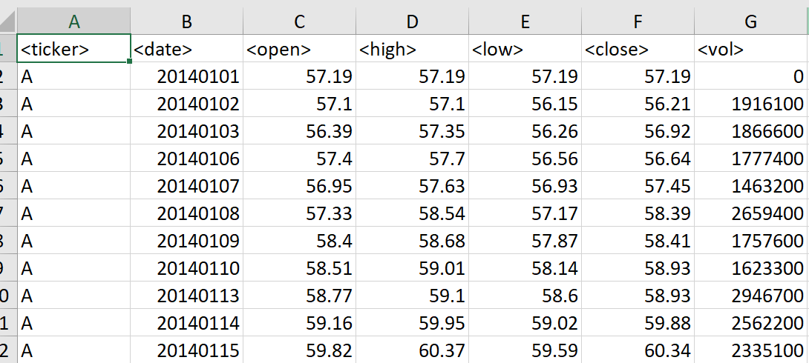
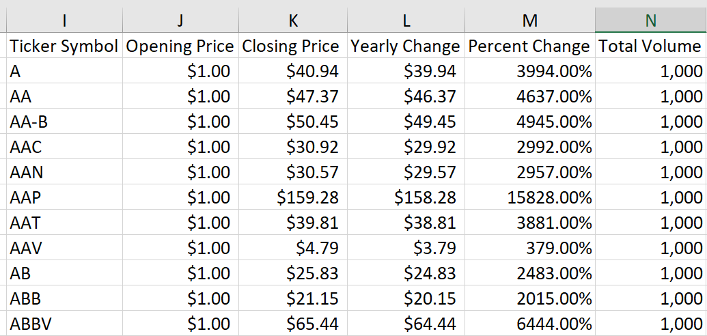

### VBA

Stock Market Analysis
* Import and Analyze stock data

    * Import data

        

    * VBA code
        ```
        
        'Create a for loop for all worksheets
        For Each ws In Worksheets

            'Create headers
            ws.Range("I1").Value = "Ticker Symbol"
            ws.Range("J1").Value = "Opening Price"
            ws.Range("K1").Value = "Closing Price"
            ws.Range("L1").Value = "Yearly Change"
            ws.Range("M1").Value = "Percent Change"
            ws.Range("N1").Value = "Total Volume"
            ws.Range("P1").Value = "Greatest % Increase"
            ws.Range("P2").Value = "Greatest % Decrease"
            ws.Range("P3").Value = "Greatest Total Volume"
            
            'Count the non-empty rows and columns
            'Ref website: Automate Excel here https://www.automateexcel.com/vba/find-last-row-column-cell/
            'Format the row and column count with numbers and comma separators
            'Ref website: Tech On The Next here https://www.techonthenet.com/excel/formulas/format_number.php
            
            last_row = Format(ws.UsedRange.Rows.Count, "#,##0")
            last_column = Format(ws.UsedRange.Columns.Count, "#,##0")
            
            'Create variables
            Dim ticker_symbol As String
            Dim open_price_start As Double
            Dim close_price_end As Double
            Dim new_ticker_row As Long
            Dim total_volume As Long
            Dim yearly_change As Double
            Dim percent_change As Double
            Dim positive_change As Boolean
            Dim negative_change As Boolean
            Dim greatest_increase As Boolean
            Dim greatest_decrease As Boolean
            Dim greatest_volume As Boolean
            
            'Set initial value of variables
            new_ticker_row = 1
            
            Dim volRange As Range
            Dim tickerRange As Range
            Dim varTicker As Variant
                
            'Set volRange = ws.range("G2:G")
            'Set tickerRange = ws.range("A2:A")
            'varTicker = "=False"
                
            
            'Create loop of worksheet through the non-empty rows
            'Ref website: Stack Overflow here https://stackoverflow.com/questions/62471422/vba-loop-how-to-get-ticker-symbols-into-ticker-column
            For i = 2 To last_row
                    
                If ws.Cells(i, 1).Value <> ws.Cells(i + 1, 1).Value Then
                        
                'WORKS!
                new_ticker_row = new_ticker_row + 1
                ticker_symbol = ws.Cells(i, 1).Value
                ws.Cells(new_ticker_row, 9).Value = ticker_symbol
                
                'DOES NOT WORK?
                open_price_start = 1
                ws.Cells(new_ticker_row, 10).Value = Format(open_price_start, "Currency")
                
                'WORKS!
                close_price_end = ws.Cells(i, 6).Value
                ws.Cells(new_ticker_row, 11).Value = Format(close_price_end, "Currency")
                
                'WORKS!
                yearly_change = close_price_end - open_price_start
                ws.Cells(new_ticker_row, 12).Value = Format(yearly_change, "Currency")
                
                'WORKS!
                percent_change = yearly_change / open_price_start
                ws.Cells(new_ticker_row, 13).Value = Format(percent_change, "Percent")
                
                'DOES NOT WORK?
                total_volume = 1000
                ws.Cells(new_ticker_row, 14).Value = Format(total_volume, "#,##0")
                
                Else

                End If
                
                'Next j
            
            'Next row
            Next i
            
            'Find the highest value in column L
            'greatest_increase =
            
            'Find the lowest value in column L
            'greatest decrease =
                
            'Autofit column widths
            ws.Columns("A:P").AutoFit
            
        Next ws

        End Sub

        ```
    * Output data
        
        
